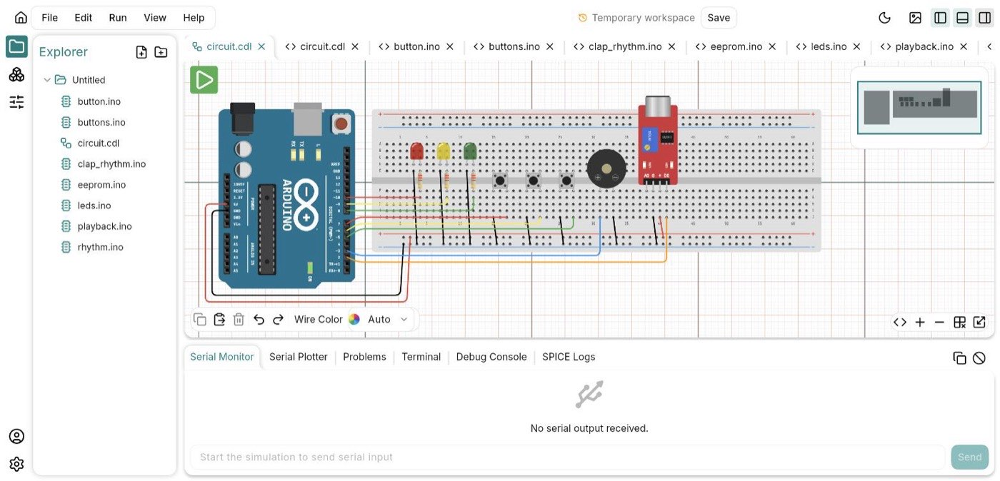

# PinBench

[](https://github.com/PinBench/pinbench/actions/workflows/ci.yml)
[](LICENSE)
[](https://flutter.dev)

**Design, code, and simulate Arduino circuits — on your desktop or in the browser.**

Place components on a breadboard, wire them up, write a sketch, press Run, and
watch the LEDs actually light. The simulator runs a real ATmega328P emulation
against an analog solver, so a missing resistor browns out your LED instead of
being silently ignored.

Works fully offline on desktop. No account required.

**[Try it in your browser →](https://pinbench.web.app/app/)**
&nbsp;·&nbsp; [What it is](https://pinbench.web.app/)
&nbsp;·&nbsp; [Download for desktop](https://pinbench.web.app/download)



<!-- Shared with the landing page rather than kept separately, so there is one
     set of screenshots to keep honest instead of two.
     TODO(demo): a docs/demo.gif of a simulation actually running would still
     earn its place — a still cannot show an LED blinking. -->

## Why this one

There are other Arduino simulators. This one is different in three ways:

- **A real analog solver.** Component values matter. Voltage dividers divide,
  and an under-sized current-limiting resistor over-drives the LED instead of
  being silently ignored.
- **Native desktop, fully offline.** No browser, no account, no connection —
  which matters in locked-down school labs and on unreliable networks.
- **Open source, open format.** Circuits are plain-text `.cdl` files you can
  read, diff, and version. Nothing is locked in a vendor's database.

## Features

- **Circuit canvas** — drag components onto a breadboard, wire them with
  multi-point orthogonal routing, rotate, flip, and edit properties. Parts snap
  to a real 0.1" hole pitch, so legs land in holes the way they do in life.
- **Code editor** — Arduino-style editor with syntax highlighting, autocomplete,
  multiple tabs, and an integrated serial terminal.
- **Real-time simulation** — ATmega328P emulation at 16 MHz plus an analog
  solver, running in a background isolate so the UI stays responsive.
- **Serial plotter** — graph values streamed over `Serial.println()`.
- **Undo/redo, copy/paste, autosave**, and full keyboard control of the canvas.
- **Cross-platform** — macOS, Windows, Linux, and the web.
- **Multi-window** on desktop.

### Components

Arduino Uno · half and full breadboards · LED · resistor · capacitor ·
potentiometer · push button · piezo buzzer · KY-037 microphone · SG90 servo

Every part is drawn at its real physical size — an Uno is 68.6 × 53.4 mm on the
canvas, and `test/features/canvas/real_world_dimensions_test.dart` keeps it that
way.

### Bundled examples

`blink` · `breadboard` · `clap_rhythm` · `mic` · `piezo_buzzer` · `servo`

## Quick start

```bash
# Prerequisites: Flutter 3.47.5 (pinned in .fvmrc; `fvm use` picks it up)
git clone --recursive https://github.com/PinBench/pinbench.git   # the .cdl/.pdl packages are submodules
cd pinbench
flutter pub get
dart run build_runner build --delete-conflicting-outputs
flutter run
```

The bundled examples ship precompiled, so they run immediately. To compile your
**own** sketches on desktop you also need `arduino-cli`:

```bash
arduino-cli core install arduino:avr
# For sketches that drive the OLED display (`Adafruit GFX Library` and
# `Adafruit BusIO` come with it as dependencies):
arduino-cli lib install "Adafruit SSD1306"
```

> Generated `*.g.dart` files are gitignored. Run `build_runner` after every
> clone, pull, or branch switch, or the build will fail with missing symbols.

### Platform notes

| Platform | Requirements | Build |
|---|---|---|
| **macOS** | Xcode 16+ | `flutter build macos` |
| **Windows** | Visual Studio 2022+, Windows SDK | `flutter build windows` |
| **Linux** | clang, cmake, ninja, pkg-config, GTK 3 dev libs | `flutter build linux` |
| **Web** | — | `flutter build web --wasm` |

The browser cannot run `arduino-cli`, so the web build compiles edited sketches
through a small remote service. Without one it still runs the bundled examples.
See [`PinBench/compile-service`](https://github.com/PinBench/compile-service) to run your own.

## Development

```bash
# Tests. The 'arduino' tag marks tests needing a local arduino-cli toolchain.
flutter test --exclude-tags arduino

# Formatting — CI enforces this at the project's page_width of 100
dart format lib test

# Web preview with local compilation: start PinBench/compile-service on :8080
# (see its README), then
flutter run -d chrome --dart-define=COMPILE_API_URL=http://localhost:8080
```


## Building from source

A build from this repository is the full local app: the canvas, the
simulator, the code editor and every component, with no account needed.
Accounts, cloud projects, sharing and the circuit assistant belong to
PinBench's hosted builds and are absent from a build from source.

The one service you may want alongside it is the compile service —
[`PinBench/compile-service`](https://github.com/PinBench/compile-service), a small
Node service wrapping `arduino-cli`, with a Dockerfile and a hardening guide —
which lets the web build compile edited sketches.

## File formats

A circuit is saved as `.cdl` and a part is described in `.pdl`. Both are
specified, with pure-Dart readers any tool can use, in their own repositories:
[`PinBench/cdl`](https://github.com/PinBench/cdl) and
[`PinBench/pdl`](https://github.com/PinBench/pdl).

## Contributing

Contributions are welcome — components, board definitions and bug fixes
especially. (The interface is English-only for now; it has no translation
support yet.)

Please read [`CONTRIBUTING.md`](CONTRIBUTING.md) first. Note that we ask
contributors to sign a [CLA](CLA.md); it takes one click, you keep your
copyright, and documentation and typo fixes are exempt.

Security issues should **not** go in a public issue — see
[`SECURITY.md`](SECURITY.md).

## Licence

- The app is **Apache-2.0** — see [`LICENSE`](LICENSE).
- The compile service is **AGPL-3.0** — see
  [`PinBench/compile-service`](https://github.com/PinBench/compile-service/blob/main/LICENSE). A commercial licence is
  available if you need to run a modified copy as a closed service.

Apache-2.0 covers the code, not the name. See [`TRADEMARKS.md`](TRADEMARKS.md) —
forking is welcome and always will be, just under your own name.

## Tech stack

| Area | Technology |
|---|---|
| Framework | Flutter 3.47+ / Dart 3.13+ |
| State | Riverpod 3.x with codegen |
| Canvas | Custom `CustomPainter` |
| Editor | `re_editor` |
| AVR emulation | `avr8_dart` (native; compiled by dart2js on the web) |
| Analog solver | `ngspice_dart` — a pure-Dart port, no FFI or native libngspice |
| Audio | `flutter_soloud` (native), Web Audio (web) |
| Multi-window | `multiview_desktop` |

---

**"Arduino" is a trademark of Arduino SA.** This project is independent and is
not affiliated with, endorsed by, or sponsored by Arduino SA. "Flutter" and
"Dart" are trademarks of Google LLC.
